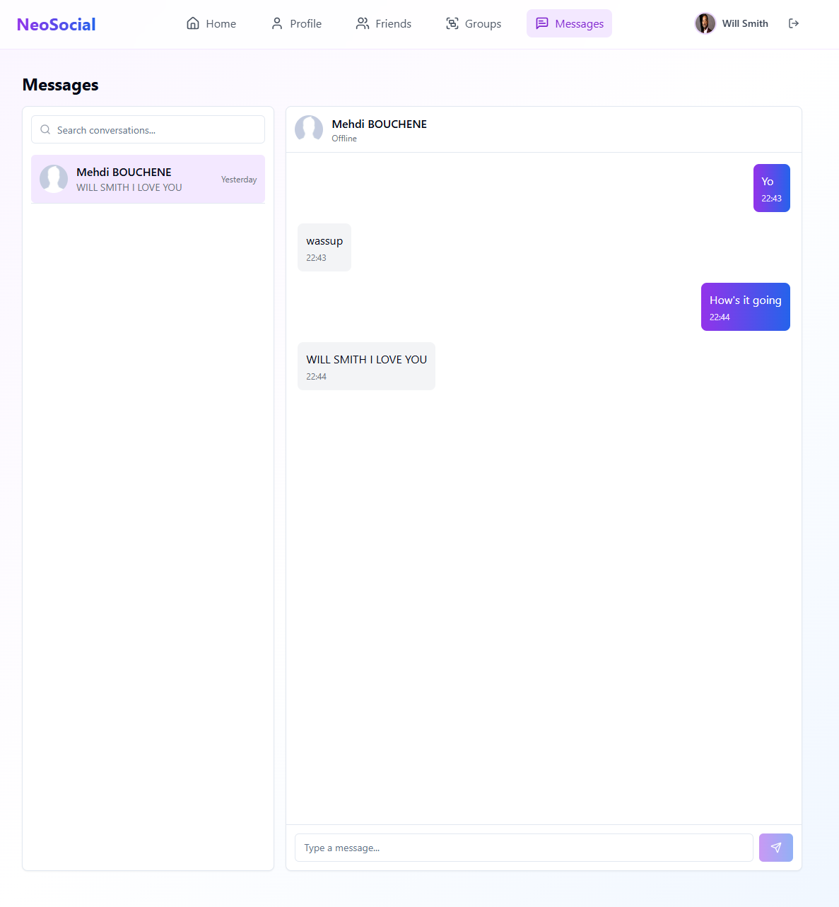

# NeoSocial

**NeoSocial** is a fully working graph-based social media platform built with React, Node.js (Express), and Neo4j. It features user-generated posts, friend and group recommendations, messaging, user profiles, and image sharing — all powered by a graph database for efficient relationship-based queries.

---

## 🧰 Tech Stack

- **Frontend**: React + TypeScript
- **Backend**: Node.js (Express) + TypeScript
- **Database**: Neo4j (Graph DB)
- **Runtime**: Concurrently via `npm run dev`

---

## 📁 Folder Structure

root/
│
├── client/ # React frontend (TypeScript)
├── server/ # Node.js backend (Express + TypeScript)
└── package.json # Runs both client and server via concurrently

---

## 🚀 Getting Started

1. **Clone the repository**

````bash
git clone https://github.com/yourusername/NeoSocial.git
cd NeoSocial

2. **Install dependencies**

```bash
cd client
npm install

cd ../server
npm install
````

3. **Set up Neo4j**

- Install Neo4j Desktop or use a cloud instance.
- Create a new database and note the connection details.
- The db schema file /db-schema.cypher contains the initial schema for Neo4j. You can run it in the Neo4j browser to set up the necessary nodes and relationships.

4. **Configure environment variables**
   Create a `.env` file in the `server` directory with the following content:

```plaintext
NEO4J_URI=bolt://xxxx:0000 # or your Neo4j instance URI
NEO4J_USERNAME=neo4j # your Neo4j username
NEO4J_PASSWORD=your_password # your Neo4j password
PORT=5000 # server port
TOKEN_SECRET=your_jwt_secret # secret for JWT authentication
```

Create a `.env` file in the `client` directory with the following content:

```plaintext
VITE_APP_API_URL=http://localhost:5000/api # URL for the backend API
```

5. **Run the application**

```bash
npm run dev
```

This will start both the client and server concurrently.

## 📖 Features

- **User Authentication**: Secure login and registration with JWT.
- **User Profiles**: View and edit user profiles with images.
- **Posts**: Create, like, and comment on posts.
- **Feed**: View a personalized feed of posts from friends and groups.
- **Friends**: Add and remove friends, view friend lists.
- **Groups**: Create and join groups, view group members.
- **Messaging**: Real-time private messaging between users.
- **Image Sharing**: Upload and display images in posts and messages.
- **Recommendations**: Friend and group recommendations based on graph relationships.

## 🧠 Database Design

NeoSocial uses a **graph database** (Neo4j) to represent users, content, and interactions as connected nodes and relationships.

### 🔹 Nodes

- `User`
- `Post`
- `Comment`
- `Group`
- `Message`
- `Conversation`
- `FriendRequest`
- `JoinRequest`
- `Notification`

### 🔗 Relationships

- `(:User)-[:POSTED]->(:Post)`
- `(:User)-[:REPOSTED]->(:Post)`
- `(:User)-[:COMMENTED]->(:Comment)`
- `(:User)-[:LIKED]->(:Post|Comment)`
- `(:User)-[:FRIENDS_WITH]->(:User)` _(bidirectional)_
- `(:User)-[:SENT_FRIEND_REQUEST]->(:FriendRequest)`
- `(:FriendRequest)-[:TO_USER]->(:User)`
- `(:User)-[:SUBMITTED]->(:JoinRequest)`
- `(:JoinRequest)-[:FOR_GROUP]->(:Group)`
- `(:User)-[:CREATED]->(:Group)`
- `(:User)-[:ADMIN_OF]->(:Group)`
- `(:User)-[:MEMBER_OF]->(:Group)`
- `(:User)-[:SENT]->(:Message)`
- `(:Message)-[:IN_CONVERSATION]->(:Conversation)`
- `(:User)-[:PARTICIPANT_IN]->(:Conversation)`
- `(:User)-[:RECEIVES]->(:Notification)`
- `(:User)-[:TRIGGERED]->(:Notification)`
- `(:Notification)-[:ABOUT]->(:Post|Comment|FriendRequest)`
- `(:Post)-[:HAS_COMMENT]->(:Comment)`
- `(:Post)-[:POSTED_IN]->(:Group)`

This schema allows for powerful queries such as:

- "Suggest friends based on mutual connections"
- "Find active groups the user might be interested in"
- "Show a user's interaction history with another person"

## 📜 License

This project is licensed under the MIT License. See the [LICENSE](LICENSE) file for details.

## 📸 Screenshots



